# MintOS操作系统设计和功能说明文档


## 队员组成

|   学号    |  姓名  |         分工         | 分数比例 |
| :-----: | :--: | :----------------: | :--: |
| 1552629 |  谢天  | 进程相关，shell相关，用户级应用 | 50%  |
| 1552653 | 李川容  |     文件系统，开机动画      | 50%  |


## 开发环境说明

#### 调试环境 : Ubuntu-16.04 64位／32位 bochs版本2.6

#### 开发环境 : windows10 1703  vscode & MacOS Sierra atom

#### 开发语言 : C

#### github地址 : https://github.com/Lichuanro/MintOS


## 系统概要

### MintOS起名原因 ： 有感于宿舍门外的薄荷叶的顽强生命力，故把我们的OS项目命名为MintOS

### 系统简介

- 更好的shell ， 带智能提示与模糊搜索

- 更多的自带命令

- 在系统提供的接口上实现了完整的二级文件系统

- 更好的进程调度，防止饥饿现象

- 更好的进程内存分配模型

- 大量的用户级应用：游戏（扫雷，2048，猜数字，五子棋），小玩意儿（幻方，八皇后）

- 更健壮的读写函数

- 优美的开机动画

- 以及为了实现上述功能所实现的大量辅助函数，字符串处理函数

  ​

## 功能简介

```
	    ls                  	list the files and folders in current directory   
            pwd				show the current directory
	    cd      [dir]        	change the directory
	    mkdir   [filename]   	create a new folder in current directory
	    create  [filename]  	create a new file in current directory
	    open    [filename]   	open the file
	    write   [filename]   	write the file
	    add     [filename]   	add new content to the file
	    rm      [filename]   	remove the file
	    mv  [filename][desdir]  move the file to destination directory
	    login   [username]   	login with the username
	    reg                  	register user
	    game                 	play games   
	    process              	show process info   
	    pm                   	manage process   	
	    quit                 	quit the shell   
```


### 更好的shell

题外话：书上的shell虽然自称是shabby_shell ，但抛开外观而言，功能上其实已经差不多做到了天花板了，该OS没有实现类似于Linux信号——Signal机制，当然会有很多不能实现的东西，例如，不能回收后台子进程，而修改这个缺陷的优雅解决方案是使用信号，然而，我们能力有限，也无法给我们的os添加这一feature。

MintOS中的shell，首先当然是有优雅的设计与流程，实现的时候完全独立实现。
先说功能，首先是特色功能，在用户输入错误的指令时，会有智能提示——

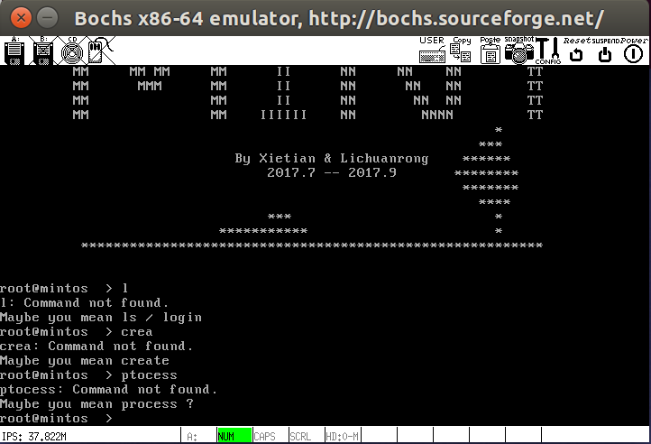

整体的设计也是更进一步:

eval函数负责执行命令

parseline函数负责解析字符串并且判断是否需要在后台执行该程序（shell会不会等待该程序完成）

```c
    char *argv[128]; /* argv for execve() */
    int bg;              /* should the job run in bg or fg? */
    int pid;           /* process id */

    /* parse command line */
  	bg = parseline(command, argv);

      if (argv[0] == 0)
  		return;   /* ignore empty lines */


  	int fd = open(argv[0], O_RDWR);
  	if (fd == -1)
  	{
  		if (!builtin_command(argv))
  		{
  			printf("%s: Command not found.\n", argv[0]);
  			ShowComplete(command);
  		}
  	}
  	else
  	{
  		if ((pid = fork()) == 0)
  		{
  			execv(argv[0], argv);
  		}
  		if(!bg)
  		{
  			int s;
  			wait(&s);
  		}
  		else
  			printf("%d %s",pid,command);
  	 }
```

builtin_command负责完成内建指令的执行工作，大部分是进程相关和文件系统相关的指令

分工明确，模块化，十分优雅的实现方式


### 更多的命令

#### process命令

打印所有进程信息

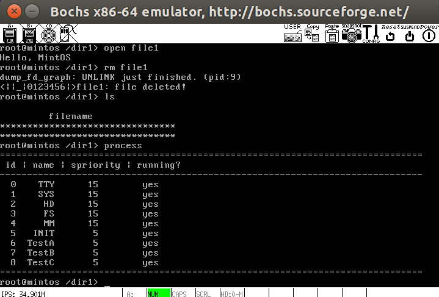

#### pm命令

可以对TestA,TestB,TestC三个进程的状态进行管理

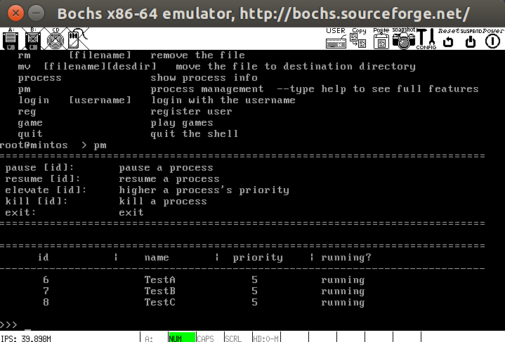

### pwd命令

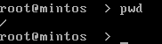


### 二级文件系统

原有的文件系统是扁平的，也就是无法创建文件夹，所有的文件位于一级目录下，体验较差。   
修改后的文件系统功能如下(非完整版)：   
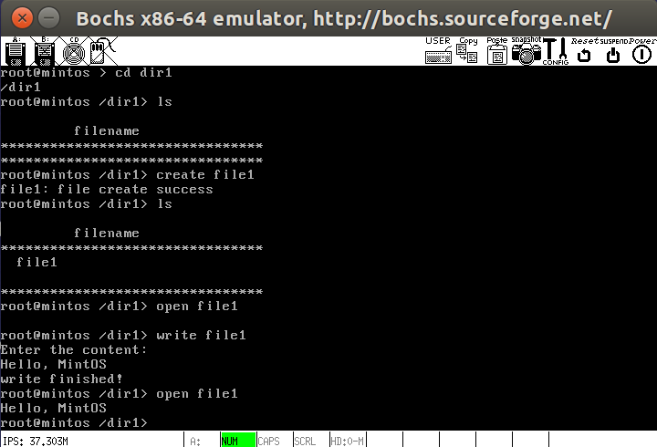   

#### 支持文件夹   
新增了创建文件夹函数  

```c
PRIVATE struct inode * create_dir(char * path)
{
    char filename[MAX_PATH];
    struct inode * dir_inode;
    if (strip_path(filename, path, &dir_inode) != 0)
        return 0;

    int inode_nr = alloc_imap_bit(dir_inode->i_dev);
    int free_sect_nr = alloc_smap_bit(dir_inode->i_dev,
                      NR_DEFAULT_FILE_SECTS);
    struct inode *newino = new_inode(dir_inode->i_dev, inode_nr,
                     free_sect_nr, I_DIRECTORY);

    new_dir_entry(dir_inode, newino->i_num, filename);

    return newino;
}
```  
修改了路径分割函数，以支持文件夹  

添加了 **_ls_** 与 **_mkdir_** 函数   
（通信部分函数）

```c
PUBLIC int ls(char *pathname)
{
    MESSAGE msg;
    msg.type = LS;


	msg.PATHNAME	= (void*)pathname;
	msg.FLAGS	= 0;
	msg.NAME_LEN	= strlen(pathname);

    send_recv(BOTH, TASK_FS, &msg);

    return msg.RETVAL;
}

PUBLIC int mkdir(const char *pathname)
{
	MESSAGE msg;

	msg.type	= MKDIR;

	msg.PATHNAME	= (void*)pathname;
	msg.FLAGS	= 0;
	msg.NAME_LEN	= strlen(pathname);

	send_recv(BOTH, TASK_FS, &msg);
	assert(msg.type == SYSCALL_RET);

	return msg.FD;
}
```

#### 路径的自由切换    
支持**绝对**路径与**相对**路径以及 **. .** 返回上级
```c
/* relative path */
char full_path[64];
char tmp[64];
if (!strcmp(argv[1], "..")) {
  char upper_path[64] = "/";
  int pos = 0;
  for (int n = strlen(current_dir) - 1; n > 0; n--) {
    if (current_dir[n - 1] == '/') {
      pos = n - 1;
      break;
    }
  }
  for (int n = 0; n < pos; n++) {
    upper_path[n] = current_dir[n];
  }

  memcpy(full_path, upper_path, 64);
}
else if (argv[1][0] != '/') {
  addTwoString(tmp, current_dir, argv[1]);
  memcpy(full_path, tmp, 64);
}
/* absolute path */
else if (argv[1][0] == '/') {
  memcpy(full_path, argv[1], 64);
}

printf("%s\n", full_path);
int fd = open(full_path, O_RDWR);
if (fd == -1) {
  printf("Cannot change directory\n");
  return 1;
}
int pos = strlen(full_path);
if (pos > 1) {
  full_path[pos] = '/';
  full_path[pos + 1] = 0;
}
memcpy(current_dir, full_path, 64);
```

#### 文件的基本操作     
调用了系统函数 **_open_ _read_ _write_ _close_** 完成了文件 **创建 删除 以及 读写 添加 移动** 等基本操作  
（部分函数示例）  
```c
void openFile(char * filename) {
  char tmp[64];
  char full_path[64];
  if (filename[0] != '/') {
   addTwoString(tmp, current_dir, filename);
   memcpy(full_path, tmp, 64);
  }
  else {
    memcpy(full_path, filename, 64);
  }
  int fd = open(full_path, O_RDWR);
  if (fd == -1) {
    printf("Cannot find file: %s\n", filename);
    return;
  }

  char content[128] = "";
  int n = read(fd, content, 128);
  content[n] = 0;
  printf("%s\n", content);
  close(fd);
}

void writeFile(char * filename) {
  char tmp[64];
  char full_path[64];
  if (filename[0] != '/') {
   addTwoString(tmp, current_dir, filename);
   memcpy(full_path, tmp, 64);
  }
  else {
    memcpy(full_path, filename, 64);
  }
  int fd = open(full_path, O_RDWR);
  if (fd == -1) {
    printf("Cannot locate file: %s\n", filename);
   return;
  }
  printf("Enter the content: \n");
  char rdbuf[128] = "";
  int n = read(0, rdbuf, 128);
  rdbuf[n] = 0;
  write(fd, rdbuf, n);
  printf("write finished!\n");
  close(fd);
}
```

### 更好的进程调度

为了防止饥饿现象的发生，给proc结构体新增runned_times和current_priority两个int成员，runned_times记录运行次数，如果运行一定时间，则会降低当前进程的当前优先级，让低优先级的进程也有机会运行。

```c
if(p_proc_ready->runned_times >= p_proc_ready->current_priority/2)//priority down as times up
{
  p_proc_ready->ticks = 0;
  p_proc_ready->current_priority = p_proc_ready->current_priority/2;
  if(p_proc_ready->current_priority == 0){
    p_proc_ready->current_priority = 1;
  }
  p_proc_ready->runned_times = 0;
}
```


### 更健壮的读写函数

因为read/write函数在某些情况下传送的字节会比应用程序所要求的要少，这些不足值不代表错误，可能是读写遇到了eof，或者是从终端读写文本行，或者是读写网络套接字。

故实现一套更加健壮的读写函数，会自动处理上文中所述的不足值。

```c
#define MINT_BUFSIZE 8192
typedef struct {
    int mint_fd;                /* Descriptor for this internal buf */
    int mint_cnt;               /* Unread bytes in internal buf */
    char *mint_bufptr;          /* Next unread byte in internal buf */
    char mint_buf[MINT_BUFSIZE]; /* Internal buffer */
} mint_t;
```

主要依靠上面所展示的缓冲区，把一个打开的文件描述符和这个缓冲区联系起来。

原理简介：当调用mint_read要求读n个字节时，读缓冲区内有mint_cnt个未读字节。若读缓冲区为空，那会调用read填满。一旦缓冲区非空，mint_read就从读缓冲区复制n和mint_cnt中较小的那个到用户缓冲区，并返回复制的字节数。

```c
int mint_read(mint_t *rp, char *usrbuf, int n)
{
    int cnt;

    while (rp->mint_cnt <= 0) {  /* Refill if buf is empty */
	rp->mint_cnt = read(rp->mint_fd, rp->mint_buf,
			   sizeof(rp->mint_buf));
	if (rp->mint_cnt < 0) {
	    if (errno != EINTR) /* Interrupted by sig handler return */
		return -1;
	}
	else if (rp->mint_cnt == 0)  /* EOF */
	    return 0;
	else
	    rp->mint_bufptr = rp->mint_buf; /* Reset buffer ptr */
    }

    /* Copy min(n, rp->mint_cnt) bytes from internal buf to user buf */
    cnt = n;          
    if (rp->mint_cnt < n)   
	cnt = rp->mint_cnt;
    memcpy(usrbuf, rp->mint_bufptr, cnt);
    rp->mint_bufptr += cnt;
    rp->mint_cnt -= cnt;
    return cnt;
}
```


### 大量的游戏以及算法应用

实现了大量的游戏及算法程序，不是builtin_command，而是用书上第十章的方法写进硬盘，真正能跑的应用级别程序。

输入game指令后，会进入game程序，内含如下所示的游戏

```c
    printf("Please choose a game:\n");
    printf("1. MineSweeper\n");
    printf("2. 2048\n");
    printf("3. GuessNumber\n");
    printf("4. Maigc Square\n");
    printf("5. GoBang\n");
    printf("6. Eight Queen\n");
```

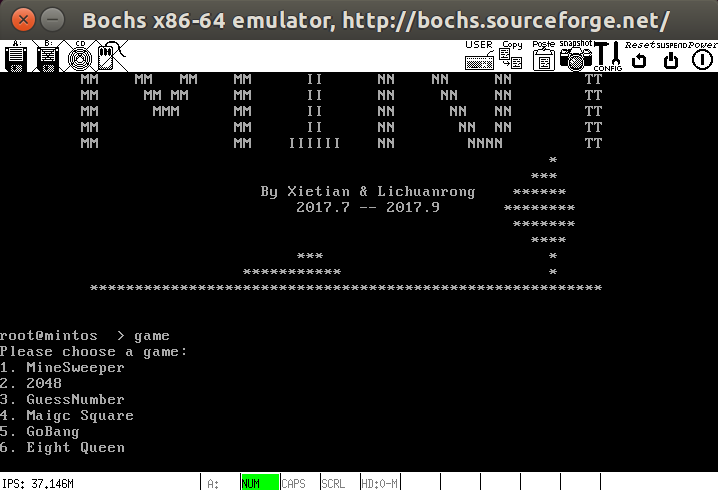    

**扫雷**      
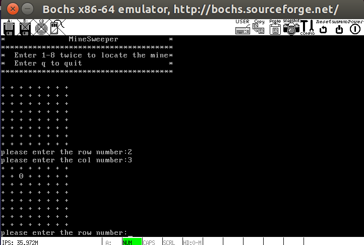   

**2048**   
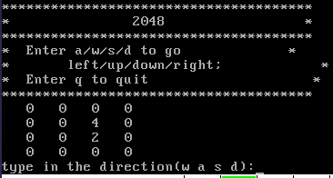  

**幻方**   
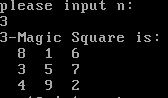   

**五子棋**    
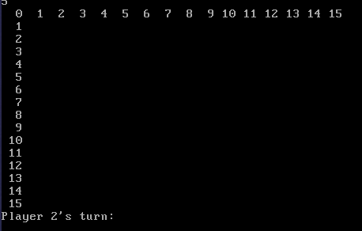  


### 更好的内存分配模型

本书中的进程内存分配简陋至极，每个进程分配1M内存，free函数简简单单返回调用函数。

这样的malloc和free有很好的吞吐率，但是内存利用率极差无比。


MintOS考虑到吞吐率和内存利用率的平衡，采用隐式空闲链表来组织空闲块，采用下一次适配法来寻找空闲块，通过给链表增加脚部来完成内存块的快速释放。

写分配器的难度不在于逻辑啊什么的，主要是操作的是裸指针，面对的是一个个的内存位，写的时候简直头皮发麻。

解决方法是定义一堆宏，不停的测试直到完全正确

```c
#define WSIZE       4       /* Word and header/footer size (bytes) */
#define DSIZE       8       /* Double word size (bytes) */
#define CHUNKSIZE  (1<<12)  /* Extend heap by this amount (bytes) */

#define MAX(x, y) ((x) > (y)? (x) : (y))  

/* Pack a size and allocated bit into a word */
#define PACK(size, alloc)  ((size) | (alloc)) //

/* Read and write a word at address p */
#define GET(p)       (*(unsigned int *)(p))           
#define PUT(p, val)  (*(unsigned int *)(p) = (val))   

/* Read the size and allocated fields from address p */
#define GET_SIZE(p)  (GET(p) & ~0x7)                  
#define GET_ALLOC(p) (GET(p) & 0x1)             

/* Given block ptr bp, compute address of its header and footer */
#define HDRP(bp)       ((char *)(bp) - WSIZE)                     
#define FTRP(bp)       ((char *)(bp) + GET_SIZE(HDRP(bp)) - DSIZE)

/* Given block ptr bp, compute address of next and previous blocks */
#define NEXT_BLKP(bp)  ((char *)(bp) + GET_SIZE(((char *)(bp) - WSIZE)))
#define PREV_BLKP(bp)  ((char *)(bp) - GET_SIZE(((char *)(bp) - DSIZE)))
```

这些宏理解正确并且完成正确的话，其实后面的逻辑很清晰，当然了，trick当然是有不少，特别是合并块的时候。

不妨看一下下一次适配搜索的代码，当然了，其实都是宏的代码可阅读性并不高。

选取下一次适配的原因是，虽然内存利用率低于最佳适配，但是速度比首次适配快，而且在隐式空闲链表的情境下，最佳适配要求对于heap做彻底的搜索，实现较为麻烦而且时间不占优势。若换成更精细的分离式空闲链表组织可以解决这一问题。

```c
   char *oldrover = rover;

    /* Search from the rover to the end of list */
    for ( ; GET_SIZE(HDRP(rover)) > 0; rover = NEXT_BLKP(rover))
        if (!GET_ALLOC(HDRP(rover)) && (asize <= GET_SIZE(HDRP(rover))))
            return rover;

    /* search from start of list to old rover */
    for (rover = heap_listp; rover < oldrover; rover = NEXT_BLKP(rover))
        if (!GET_ALLOC(HDRP(rover)) && (asize <= GET_SIZE(HDRP(rover))))
            return rover;

    return NULL;  /* no fit found */
```


### 优美的开机动画
利用 _printf_ 函数以及 _延时_ 函数实现了薄荷叶的运动   

以下为结束画面      
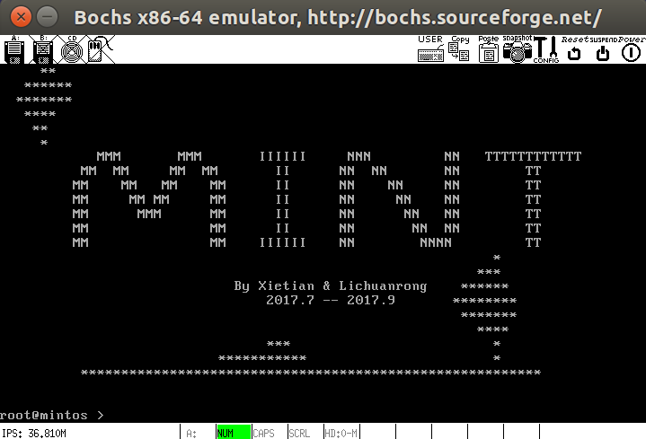


## 参考文献

|          书名          |  作者  |   出版社   |
| :------------------: | :--: | :-----: |
| 《Orange S:一个操作系统的实现》 |  于渊  | 电子工业出版社 |
|      深入理解计算机系统       | Bryant,R.E  | 机械工业出版社 |


​
